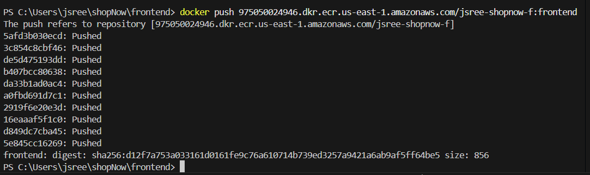
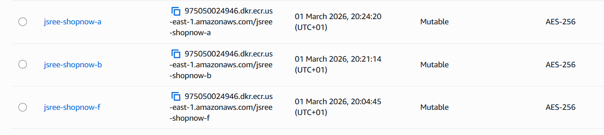
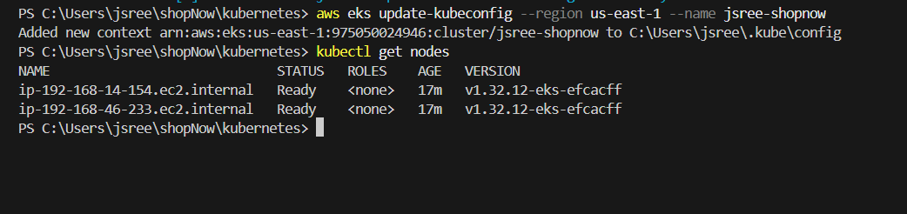
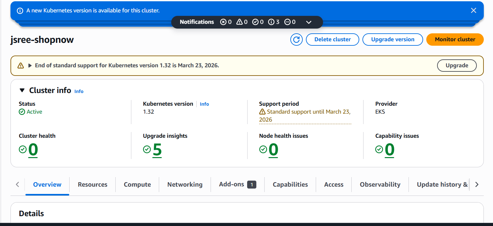
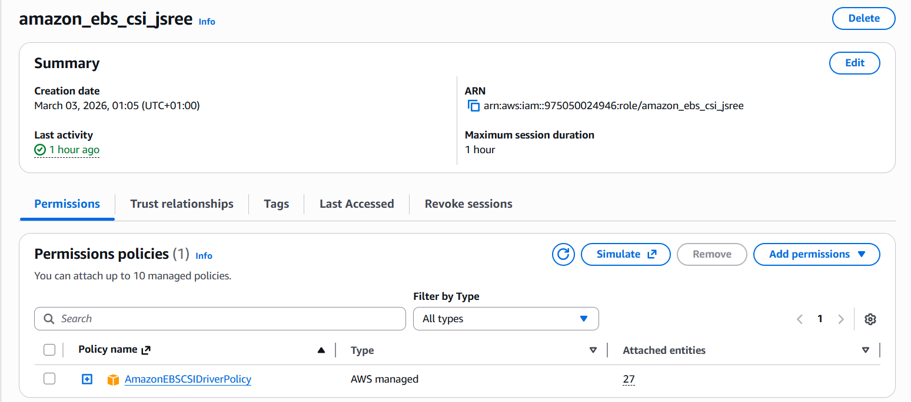
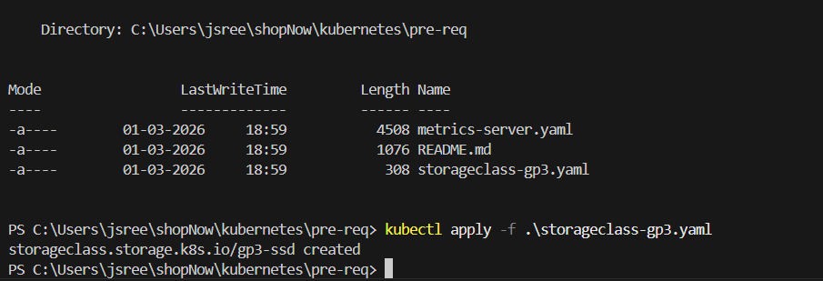
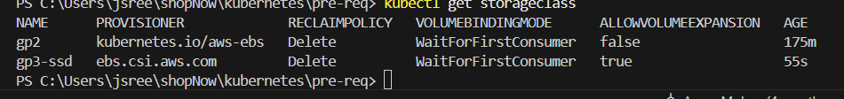
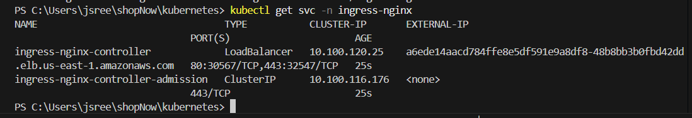

First I made the necessary changes in the yaml scripts and instructed
Second I made sure that all necessary tools are installed and configured, like aws cli, eksctl, kubectl and helm. 
and then decide to build docker images for frontend, backend and admin services. 

created a directoy in aws ECR for frontend using the command 
aws ecr create-repository --repository-name jsree-shopnow-f --region us-east-1

building the images
docker build -t jsree-shopnow-f:frontend .

tag
docker tag jsree-shopnow-f:frontend 975050024946.dkr.ecr.us-east-1.amazonaws.com/jsree-shopnow-f:frontend

push the image into ECR
docker push 975050024946.dkr.ecr.us-east-1.amazonaws.com/jsree-shopnow-f:frontend

the same method was followed for other two services (backend and admin)

next step is to create an EKS cluster, command used
eksctl create cluster --name jsree-shopnow --region us-east-1 --nodegroup-name standard-workers --node-type t3.medium --nodes 2 --nodes-min 1 --nodes-max 4

next is to update the kube config, command used aws eks --region us-west-1 update-kubeconfig --name jsree-shopnow

Then, I decided to follow the first method (i.e) to deploy using Raw Kubernetes Manifest, to get better undertand. 

next step into install the pre-request, storage (EBS-CSI), ingress controller and metrics-server
 to attach the EBS-CSI, I first created a role in IAM and used AmazonEBSCSIDriverpolicy as I faced IAM permission issue
 

 deployed the storage class yaml file, command kubectl apply -f <file name>
  

verify the storageclass, command used kubectl get storageclass
  

installed ingress controller
  

deployed metric-server yaml file
  

deployed namespace 
  

next step is to create the mongoDB pod, applied deployment and service yaml file
  
  

next step isto deploy the backend application, to acheive this I first deployed the configmap, secrets, deployment, service and hpa respectively. , I faced CrashLoopbackoff error, while I checked the logs, the error was host not found in upstream "backend-service", that is backed container is trying to connect to backend-service but kubernetes cannot resolve this service name, I opened the service.yml file of backend and name the service to backend-service, then re-applied the service.yml file and the pod came to runnign state. 
  
  

next, I deployed the frontend application, in the order of configmap, secrets, deployment, service, and hpa respectively. faced issue on CrashLoopBackoff, reason host not found in upstream "backend". so I created a new service.yml for frontend application naming service name as backend and then the issue was resolved. 
  
  

deployed admin application

deploying ingress, after deploying ingress, ingress acts as a smart routing, one entry point, it routes multiple service. 

deployed daemonset

user creation for backend, 

To automate the build and deployment process, I followed the follwing way

Push code ---> GitHub ---> Jenkins Pipeline ---> Build Docker image ---> Push image to ECR ---> update YAMl in Git ---> Argocd detects change ---> Deploy to Kubernetes. 

